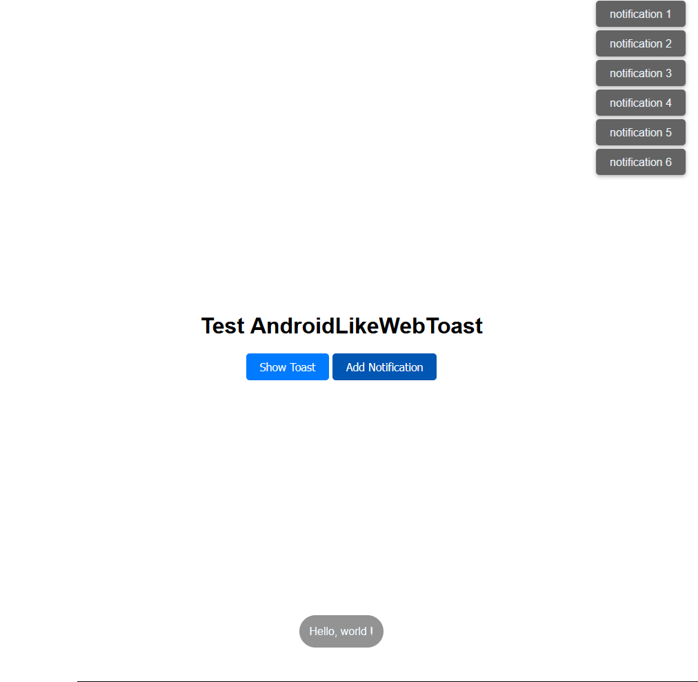

# AndroidLikeWebToast v1.0.0

**A JavaScript module for displaying toast notifications with an Android-like appearance and behavior.**

## Description

AndroidLikeWebToast is a versatile JavaScript module designed to bring the familiar and sleek look of Android-style toast notifications to web applications. This module provides a simple API for creating and managing toast notifications that blend seamlessly with web interfaces, delivering a consistent and user-friendly experience.

## Features

- **Android-like Design**: Mimics the clean and modern look of Android toast notifications.
- **Customizable**: Offers various options to customize the appearance, duration, and behavior of notifications.
- **Easy Integration**: Easily integrate with your existing web projects by including the module and using its straightforward API.
- **Responsive**: Designed to work well across different devices and screen sizes.

## Preview


## Usage

1. Include the `Toast.css` file in your HTML.
2. Import the `Toast.js` file in your main javascript file.
3. Instantiate the `Toast` class and use its methods to display notifications juste like Android.

or

3. Instantiate the `ToastDisplayer` class and use its methods to display a 3 second notifications on a container that will accumulate notifications.

## Exemple
### Using Toast class
```javascript
const toast = Toast.makeText(document.body, "Hello, world !", Toast.LENGTH_LONG);
toast.show();
```
**Note:** Toast messages have a one-shot instance. Set the sticky flag to `true` if you want your message to be reusable. Like so :

```javascript
const toast = Toast.makeText(document.body, "Hello, world !", Toast.LENGTH_LONG, true); 
```

### Using ToastDisplayer class
```javascript
const toast_displayer = new ToastDisplayer(document.getElementById("notifications"));
toast_displayer.display("A Foo notification");
toast_displayer.display("A Bar notification (with a 5 seconds duration)", 5000); 
```
 
## Author

 `Arnaud Sénécaut`

## License

MIT License - https://opensource.org/licenses/MIT

 

This software is provided "as is", without warranty of any kind. See the LICENSE file for more details.
